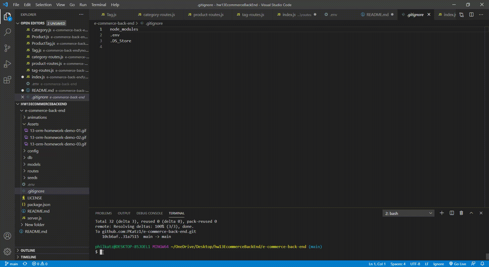

<h1 align="center">Object-Relational Mapping (ORM): E-Commerce Back End 👋</h1>
  ## Description

🔍 A mysql database and application backend for an e-commerce site. Built using MySQL2, Express, Sequelize and dotenv.
  
💻 Below is the gif showing the functionality of the application:
  



## User Story
  
```
AS A manager at an internet retail company
I WANT a back end for my e-commerce website that uses the latest technologies
SO THAT my company can compete with other e-commerce companies
```
  
## Acceptance Criteria
  
``` 
GIVEN a functional Express.js API
WHEN I add the database name, MySQL username, and MySQL password to an environment variable file
THEN I can link a database using Sequelize
WHEN I enter schema and seed commands
THEN a development database is created that is seeded with test data
WHEN I enter the command to invoke the application
THEN the server is started and the Sequelize models are synced to the MySQL database
WHEN I open API GET routes in Insomnia for categories, products, or tags
THEN the data for each of these routes is displayed in JSON format
WHEN I test API POST, PUT, and DELETE routes in Insomnia
THEN I am able to successfully create, update, and delete data in my database
```
  
## Table of Contents
- [Description](#description)
- [User Story](#user-story)
- [Acceptance Criteria](#acceptance-criteria)
- [Table of Contents](#table-of-contents)
- [Installation](#installation)
- [Usage](#usage)
- [Testing](#testing)
- [Contributing](#contributing)
- [Questions](#questions)

## Installation
💾   
  
`npm init`

`npm install mysql2`

`npm install sequelize`

`npm install dotenv`
  
## Usage
💻   
  
Run the following command at the root of your project and answer the prompted questions:

`mysql -u root -p`

Enter PW when promted

`source db/schema.sql`

`quit`

`npm run seed`
  
`npm start`

## Testing
✏️

No testing is currently set up


## Questions
✉️ Contact me with any questions: [email](mailto:pkatz@finkkatz.com) , [GitHub]https://github.com/PKatz1)<br />